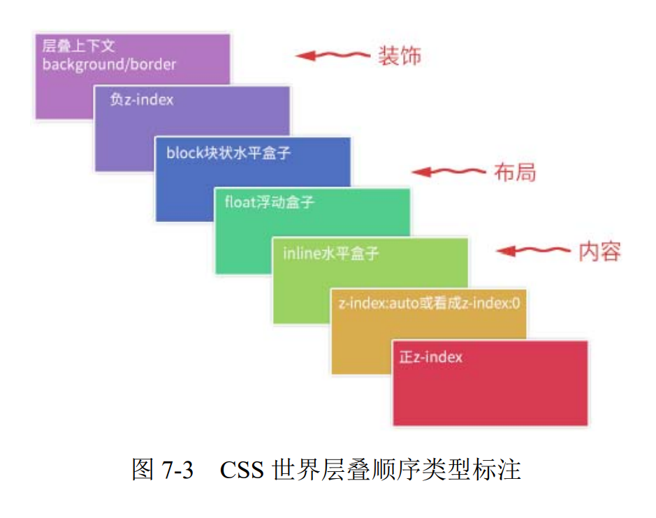

## 如果一个元素含有层叠上下文，我们可以理解为这个元素在 z 轴上就“高人一等”

## 层叠水平，决定了同一个层叠上下文中元素在 z 轴上的显示顺序



## CSS 层叠规则

- 不同级，谁大谁上
- 同级，后来居上

## 层叠上下文特性

- 层叠上下文层叠水平比普通元素高
- 层叠上下文可以阻断混合模式（CSS3 中的 isolation）
- 层叠上下文可以嵌套，内部的元素受制于外部
- 层叠上下文与兄弟元素独立
- 每个层叠上下文自成体系

## 层叠上下文的创建

- 天生派：根元素，称根层叠上下文
- 正统派：z-index 为数值的传统层叠上下文
- 扩招派：其他 css 属性

## 定位与层叠

position 为 relative/absolute 下含有 fixed 定位元素，z-index 不为 auto 时会创建层叠上下文（这条规则对 chrome 不适用）

```
<!-- 美女在上，美景在下 -->
<div style="position:relative; z-index:auto;">
 <!-- 美女 -->
 
</div>
<div style="position:relative; z-index:auto;">
 <!-- 美景 -->
 
</div>

<!-- 美景在上，美女在下 -->
<div style="position:relative; z-index:0;">
 <!-- 美女 -->
 
</div>
<div style="position:relative; z-index:0;">
 <!-- 美景 -->
 
</div>

<!-- div的z-index是auto时，两个img不受父级影响，遵循谁大谁上 -->
<!-- z-index为数值是就创建了层叠上下文 -->
```

## CSS3 与层叠上下文

- 元素为 flex 布局元素（父元素 display:flex|inline-flex），同时 z-index 值不是 auto。
- 元素的 opacity 值不是 1。
- 元素的 transform 值不是 none。
- 元素 mix-blend-mode 值不是 normal。
- 元素的 filter 值不是 none。
- 元素的 isolation 值是 isolate。
- 元素的 will-change 属性值为上面 2 ～ 6 的任意一个（will-change:opacity、will-chang:transform 等）。
- 元素的-webkit-overflow-scrolling 设为 touch

##

```
<div class="box">
    <span class="text">只有图片淡出，文案一直100%透明</span>
    
</div>

@keyframes fadeIn {
  0% { opacity: 0; }
  100% { opacity: 1; }
}

.box {
  width: 256px; height: 192px;
  position: relative;
}
.text {
  line-height: 30px;
  position: absolute; left: 0; right: 0; bottom: 0;
  background-color: rgba(0,0,0,.5);
  color: #fff;
  text-align: center;
  font-size: 14px;
}
.fade {
  animation: fadeIn 2s 2s infinite;
}
<!-- opacity 的值不是 1 的时候，是具有层叠上下文的，层叠顺序是z-index:auto级别，跟没有 z-index 值的 absolute 绝对定位元素是平起平坐的 -->
```

## 负 z-index

```
<!-- 背景在上，图片在下 -->
<div class="box">
 
</div>
.box {
 background-color: blue;
}
.box > img {
 position: relative;
 z-index: -1;
 right: -50px
}

<!-- 修改box -->
.box {
 background-color: blue;
 transform: scale(1);
}
<!-- 结果背景在下了 -->
<!-- 原因：transform 可以让元素具有新的层叠上下文 -->
```

## 负 z-index 的应用

- 可访问性隐藏
- 定位在元素的后面（比如纸张的边角有卷起来的效果）
